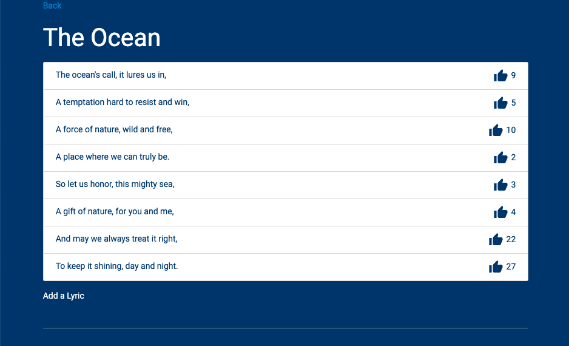

# Lyrical 

  ## Description

  This is a simple songwriting app that allows users to add a song title and to add lyrics to the song.  Users can then upvote song lyrics that they like under any song on the site.  This app was built using React, MongoDB/Mongoose, Apollo Server, and graphQL.  
  
  Below is a screenshot of the app:
  
  

  ## Table of Contents
  
  - [Installation](#installation)
  - [Usage](#usage)
  - [License](#license)
  - [Contributing](#contributing)
  - [Tests](#tests)
  - [Questions](#questions)
  
  ## Installation
  
  npm install
  
  ## Usage
  
  npm run dev

  ## License
This application is covered under the MIT License.
 For more information: https://opensource.org/licenses/MIT
  
  ## Contributing
  N/A
  
  ## Tests
  N/A

  ## Questions
  Contact Info 
  GitHub user name: BillStephens2022 
  Link to GitHub profile: https://github.com/BillStephens2022 
  Email: stephensbill17@gmail.com

